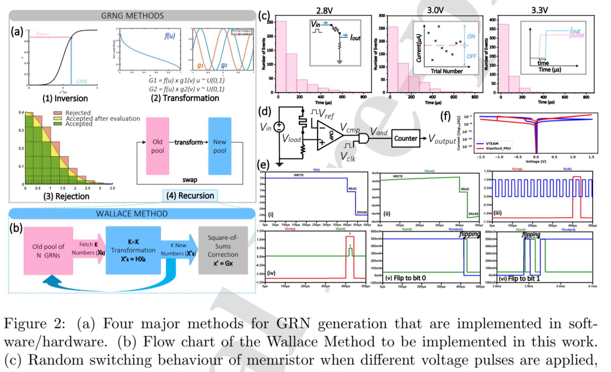

# [WALLAX: A memristor-based Gaussian random number generator](https://www.sciencedirect.com/science/article/abs/pii/S0925231223010561?via%3Dihub)

## Notes
- GRNG: Gaussian Random Number Generator
- Memristive Wallace-Based GRNG
- Use bit-slicing to reduce the required bit per cell to reduce accuracy loss during crossbar computation
- URNG: Uniform Random Number Generator
- Wallace Method
    - Improves gaussian rng by eliminating evaluating functions
- Memristive stochastic behavior between ON/OFF states can serve as a basis for URNG for Wallace
- Process:
    1. URNG (Generate 9-bits)
    2. Compute the in-memory address
    3. Transformation into a matrix
    4. Chi-Square Correction
- Simulations with MemTorch
- Passes NIST Random test
    - Test using Binary Phase Shift Keying (BPSK) Bit Error Rate (BER) testing
    - Next do M-ary Phase Shift Keying (MPSK)
    - Seek out the Symbol Error Rate (SER)
- Achieves a throughput of 300kb/s
    - Big improvements to power and area



## Thesis notes
- Discuss MemTorch software
- Discuss URNG and Wallace method
- NIST Randomness test
- Section 4.4: How ambient temperature can affect results and I-V curve

## References

```
@article{DONG2023126933,
title = {WALLAX: A memristor-based Gaussian random number generator},
journal = {Neurocomputing},
pages = {126933},
year = {2023},
issn = {0925-2312},
doi = {https://doi.org/10.1016/j.neucom.2023.126933},
url = {https://www.sciencedirect.com/science/article/pii/S0925231223010561},
author = {Xuening Dong and Amirali Amirsoleimani and Mostafa Rahimi Azghadi and Roman Genov},
keywords = {Memristor, Crossbar, Vector-matrix multiplication, Gaussian random number generator},
abstract = {Generating Gaussian random numbers is essential in many applications such as cryptography, games, and computer simulations. Although software Gaussian Random Number Generators (GRNG) are widely used, hardware designs have been explored for their faster speed and lower computational cost. However, hardware GRNGs usually occupy large silicon areas when implemented in Complementary Metal Oxide Semiconductor (CMOS) technology, especially for their essential Uniform Random Number Generator (URNG) part. Here, we present a memristor-based GRNG, named WALLAX, conceived from the Wallace method to generate random numbers iteratively. This GRNG circuit benefits not only from the fully parallel analog-based Vector Matrix Multiplication (VMM) feature of memristive crossbars but also harness the intrinsic stochastic switching behaviour of the memristive devices to efficiently produce truly random numbers. The vector-matrix multiplication of WALLAX is implemented on the memristive crossbar, while its random fetching step is realized by a URNG based on the stochastic switching nature of memristors. WALLAX successfully passes all the tests in the NIST 800-22 randomness test suite with 105 numbers generated and five goodness-of-fit tests with various pool sizes and effectively reduces the power and area consumption by 68.78% and 70.0% compared to digital implementations of the same GRNG method. The impact brought by memristor non-idealities is investigated by simulating the proposed structure with 1000 pools under various scenarios. Wire resistance and the stuck of state, each result in a 2.2% and 12.3% reduction in test pass rate within the tested range, respectively.}
}
```
