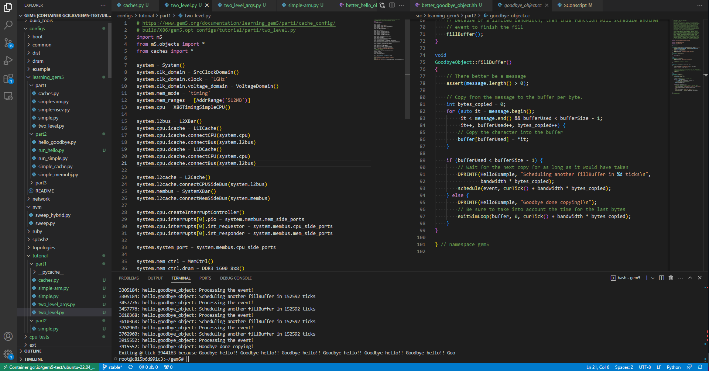

# Building & Running Whetstone/Dhrystone in Gem5

## Running Whetstone

The [Whetstone benchmark](https://en.wikipedia.org/wiki/Whetstone_(benchmark)) is a tool used for evaluating the peformance of floating point numbers in a CPU. It was originally written in 1972 although [modern versions](https://netlib.org/benchmark/whetstone.c) can be found today.

I found a version of this on [Netlib](https://netlib.org/) which appears to be an archive of computer science-related academic material.

I just copied their Whetstone algorithm into my Gem5 environment, which is running in a Docker container.



To make my life much easier when doing development, I have installed the [Docker extension for Visual Studio Code](https://code.visualstudio.com/docs/containers/overview) which allows me to attach a VSCode window to my Docker container. I get syntax highlighting, a terminal bottom pane, and file browser to the left.

I will re-use the onboarding Python script developed at the [start of the tutorial](https://www.gem5.org/documentation/learning_gem5/part1/simple_config/) since I know that wil just run.

The Whetstone code is placed into `tests/test-progs/whetstone/src/whetstone.c`.

<!--
I add a line near the top of the program which enables debugging:

```c
#define PRINTOUT true
```
-->

Now I need to actually build the program, since I require a pre-compiled binary to run. This can be done by running `g++ -static -o whetstone whetstone.c` from the program's subdirectory.

We will get a binary file called `whetstone`.

This program can be run with a flag marking the number of loops to perform. Just to ensure that it works, I can actually run it in the Docker container directly since everything is just Linux.

```
root@c815b6d991c3:~/gem5/tests/test-progs/whetstone/src# ./whetstone

Insufficient duration- Increase the LOOP count

root@c815b6d991c3:~/gem5/tests/test-progs/whetstone/src# ./whetstone -c 1000000

Loops: 1000000, Iterations: 1, Duration: 42 sec.
C Converted Double Precision Whetstones: 2381.0 MIPS

# ...

Loops: 1000000, Iterations: 1, Duration: 42 sec.
C Converted Double Precision Whetstones: 2381.0 MIPS

Loops: 1000000, Iterations: 1, Duration: 43 sec.
C Converted Double Precision Whetstones: 2325.6 MIPS

# ...

```

This took a while to complete. Choosing a million for the loop count was overkill (30000 seems to be better). Still, this shows the program works. Now that I know it works, I can update my Python script to run that binary instead. I also need to ensure that I update the command-line argument below.

```python
binary = 'tests/test-progs/whetstone/src/whetstone'
# for gem5 V21 and beyond
system.workload = SEWorkload.init_compatible(binary)

process = Process()
process.cmd = [binary, '-c', 3000]
```

Then the script is run:

```
root@c815b6d991c3:~/gem5# build/X86/gem5.opt configs/tutorial/part1/simple.py
gem5 Simulator System.  https://www.gem5.org
gem5 is copyrighted software; use the --copyright option for details.

gem5 version 22.1.0.0
gem5 compiled Apr 16 2023 04:03:40
gem5 started Apr 20 2023 21:49:19
gem5 executing on c815b6d991c3, pid 630
command line: build/X86/gem5.opt configs/tutorial/part1/simple.py

Global frequency set at 1000000000000 ticks per second
build/X86/mem/dram_interface.cc:690: warn: DRAM device capacity (8192 Mbytes) does not match the address range assigned (512 Mbytes)
0: system.remote_gdb: listening for remote gdb on port 7000
Now entering a computer simulating a computer
build/X86/sim/simulate.cc:192: info: Entering event queue @ 0.  Starting simulation...
build/X86/sim/syscall_emul.cc:74: warn: ignoring syscall set_robust_list(...)
build/X86/sim/syscall_emul.cc:74: warn: ignoring syscall rseq(...)
build/X86/sim/mem_state.cc:443: info: Increasing stack size by one page.
build/X86/sim/syscall_emul.hh:1014: warn: readlink() called on '/proc/self/exe' may yield unexpected results in various settings.
      Returning '/root/gem5/tests/test-progs/whetstone/src/whetstone'
build/X86/sim/syscall_emul.cc:74: warn: ignoring syscall mprotect(...)

Loops: 1000, Iterations: 1, Duration: 13 sec.
C Converted Double Precision Whetstones: 7.7 MIPS
That's all folks: 13043184134000 and exiting with last active thread context
```

Running the program takes a while to get started, and there are a few warnings suggesting I could do things better. You do see that the speed is much slower (**7.7 MIPS**) and part of that is due to the specific configuration of my simulated computer. Future development here could be identifying new ways to improve performance here through all kinds of methods.

## Dhrystone

Similarly, the [Dhrystone benchmark](https://en.wikipedia.org/wiki/Dhrystone) measures performance for integers. The name comes from a pun, as a 'floating' point number would be wet and its opposite would be dry.

Not finding a good copy on Netlib, I found a version from [Keith Thompson on GitHub](https://github.com/Keith-S-Thompson/dhrystone/blob/master/v2.1/dhrystone.c) with the number of loops baked in with `#define LOOPS` on line `387`.

That's fine. Just like before I copied the source into my Docker container and compiled using `g++`.

```
cd tests/test-progs/dhrystone
g++ -static -o dhrystone dhrystone.c
```

This gave me a ton of errors, as the C program I downloaded was quite old and apparently did not vibe with my modern compiler. I have linked [a fixed version](dhrystone.c) of the code. I can't say it's the best C ever written, but it runs. (As a side note, why were old computer scientists so bad at naming functions? We haven't changed.)

The program is _really_ old. It defines `LOOPS` as 500,000 for "faster machines" but that runs instantly in my Docker container. I updated that to 50 million.

```
root@c815b6d991c3:~/gem5/tests/test-progs/dhrystone# ./dhrystone
Dhrystone(1.1) time for 50000000 passes = 5
This machine benchmarks at 9596928 dhrystones/second
```

Even that took only five seconds.

Returning to my `simple.py`, I reset `LOOPS` to 30000 for the simpler system and reran the simulation. (I came to that number by playing around with a few different values until I found that which took a reasonable length of time to complete.)

```
root@c815b6d991c3:~/gem5# build/X86/gem5.opt configs/tutorial/part1/simple.py
gem5 Simulator System.  https://www.gem5.org
gem5 is copyrighted software; use the --copyright option for details.

gem5 version 22.1.0.0
gem5 compiled Apr 16 2023 04:03:40
gem5 started Apr 21 2023 04:04:55
gem5 executing on c815b6d991c3, pid 4851
command line: build/X86/gem5.opt configs/tutorial/part1/simple.py

Global frequency set at 1000000000000 ticks per second
build/X86/mem/dram_interface.cc:690: warn: DRAM device capacity (8192 Mbytes) does not match the address range assigned (512 Mbytes)
0: system.remote_gdb: listening for remote gdb on port 7000
Now entering a computer simulating a computer
build/X86/sim/simulate.cc:192: info: Entering event queue @ 0.  Starting simulation...
build/X86/sim/syscall_emul.cc:74: warn: ignoring syscall set_robust_list(...)
build/X86/sim/syscall_emul.cc:74: warn: ignoring syscall rseq(...)
build/X86/sim/mem_state.cc:443: info: Increasing stack size by one page.
build/X86/sim/syscall_emul.hh:1014: warn: readlink() called on '/proc/self/exe' may yield unexpected results in various settings.
      Returning '/root/gem5/tests/test-progs/dhrystone/dhrystone'
build/X86/sim/syscall_emul.cc:74: warn: ignoring syscall mprotect(...)
Dhrystone(1.1) time for 30000 passes = 1
This machine benchmarks at 18181 dhrystones/second
That's all folks: 1654060287000 and exiting with last active thread context
```

You can see it runs at **18181 dhrystones/second**, much slower than the near 10 million of my standard Docker container.

## Conclusion

Through this demo, I mainly learned a bit about extending Gem5 with custom code. It's quite neat that you can pretty much take a C program off-the-shelf and run it on a number of different hypothetical architectures.

Of course, this in itself was not the goal. As my research continues, this serves as a good starting point for continuing to investigate ways to improve performance with these and other benchmarks.
