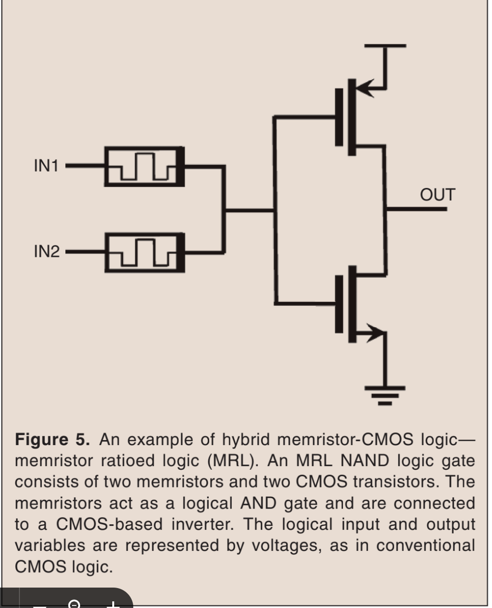

# [The Desired Memristor for Circuit Designers](https://ieeexplore.ieee.org/document/6518267)
_Published in 2013_

## Notes
- "Practical memristors behave non-linearly"
- Non-destructive reads may be possible, but reading can cause some drift so rewriting is sometimes necessary
- Computational elements for analog circuits



## Summary

This is an editorial written by Kvatinsky and others in 2013 for an IEEE journal, Circuits and Systems, that introduces the memristor to the readers and explains in very broad details what makes it interesting. As this is not an academic paper, and one that is rather outdated, there's not a lot of interesting details to comment here.

## References

```
@ARTICLE{6518267,
  author={Kvatinsky, Shahar and Friedman, Eby G. and Kolodny, Avinoam and Weiser, Uri C.},
  journal={IEEE Circuits and Systems Magazine}, 
  title={The Desired Memristor for Circuit Designers}, 
  year={2013},
  volume={13},
  number={2},
  pages={17-22},
  doi={10.1109/MCAS.2013.2256257}}
```