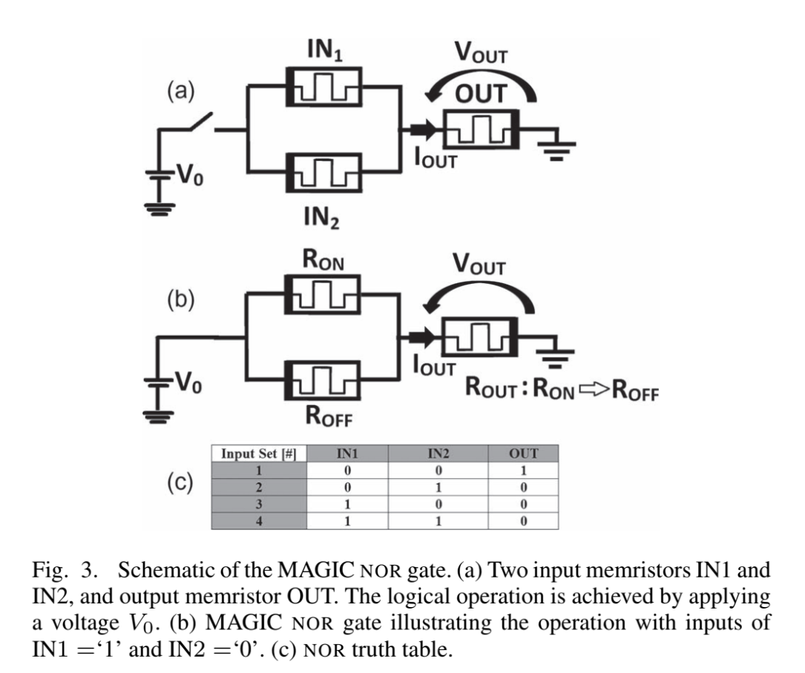

# [VTEAM: A General Model for Voltage-Controlled Memristors](https://ieeexplore.ieee.org/document/7110565)

_Published in 2015_

## Notes

- TEAM: Memristor model: ThrEshold Adaptive Memristor Model
- Introduces VTEAM: voltage-threshold rather than current threshold
- It's clear that I am reading these papers out of order
- "A memristive crossbar is a common memristive memory structure"
- Figure 3 shows a MAGIC NOR gate
- VTEAM is meant to be a general memristor model. Equations for its behavior are illustrated here.



## Summary

This is one of those classic Kvatinsky seminal papers where VTEAM is introduced as a new SPICE model for memristors which uses voltage as the primary mechanism for switching resistive states. They compare it to TEAM, the previous standard model, and demonstrate in their simuations the performance.

## Pros

It is interesting to see the paper start from some first principles by defining the core mathematics for memristor behaviors and developing an effective model. Some diagrams like the MAGIC NOR gate are useful to have as reference.

## References

```
@ARTICLE{7110565,
  author={Kvatinsky, Shahar and Ramadan, Misbah and Friedman, Eby G. and Kolodny, Avinoam},
  journal={IEEE Transactions on Circuits and Systems II: Express Briefs}, 
  title={VTEAM: A General Model for Voltage-Controlled Memristors}, 
  year={2015},
  volume={62},
  number={8},
  pages={786-790},
  doi={10.1109/TCSII.2015.2433536}}
```