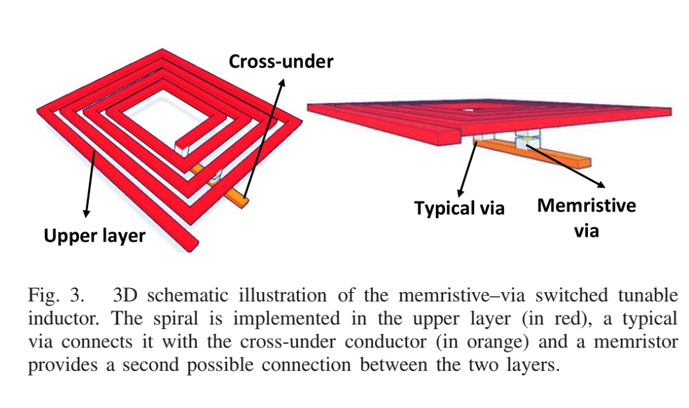

# [TIME—Tunable Inductors Using MEmristors](https://ieeexplore.ieee.org/document/8074744)
_Published in 2018_

## Notes

- RFMS: Radio-Frequency Memristive Switches
- Inductors are important in radio applications
    - Integrated inductors are metal spirals to take advantage of inductance between levels
- Tunable inductors are a big deal, particularly for optimization and tuning
- Makes a reference to VTEAM
- Memristive Via creates second connection point between layers of this induction network
    - Can change number of turns from 2-4 just by swapping memristance without affecting HW area
- Simulated using ADS (Advanced Design System) from Keysight Technologies
    


## Summary

This paper proposes using memristors as electronic switches to "short-circuit" inductor systems in order to control them in a new way that can reduce the total physical area.

## Pros

This idea is clever. It demonstrates clear benefits.

## Cons

In the paper, it talks about areas on the order of nanometers. Perhaps some applications will have see benefit from saving a dozen nm, but probably not many. Electronic switches are neat ideas, but why can transistors not be employed here? Is there a big interference problem that cannot be isolated? Power is also reduced, but is it a significant amount (probably, since radios tend to be power-hungry).

## References

```
@ARTICLE{8074744,
  author={Wainstein, Nicolás and Kvatinsky, Shahar},
  journal={IEEE Transactions on Circuits and Systems I: Regular Papers}, 
  title={TIME—Tunable Inductors Using MEmristors}, 
  year={2018},
  volume={65},
  number={5},
  pages={1505-1515},
  doi={10.1109/TCSI.2017.2760625}}
```